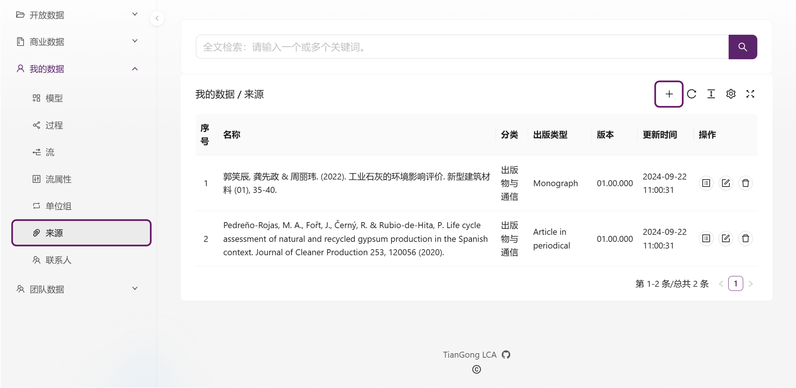

# 我的数据

**我的数据**模块由单元过程、流、流属性、单位、来源、联系人六部分构成，用户可以根据需要自主构建数据。

## 单元过程

用户可以通过点击页面上的“+”来创建新的单元过程，

在输入输出流部分，用户可以通过点击“+”来添加相关的输入输出流。

## 流

用户可以通过点击“+”来创建新流，

成功创建新流后，可在右侧构建“模型”，

进入模型构建页面后，通过点击“+”创建并编辑模型，

在模型编辑页面，用户可以通过点击“+”添加节点，并通过拖拽节点方框的边缘点来调整方向；点击右侧的“i”可以添加模型的基本信息，

点击箭头符号并选择“交换关系”来添加交换关系，选择源输出流和目标输入流。

## 流属性

用户可以通过点击“+”来创建新的流属性。

## 单位

用户可以通过点击“+”来创建新的单位。

```bash
天工数据的单位模块已按照国际标准构建，用户可直接引用。
```
## 来源

在天工生命周期数据平台中，来源模块用于定义和管理与数据集相关的来源信息，包括文献、报告、研究数据或其他相关资料。

**创建一条新的“来源”数据**

**第一步：点击“+”按钮新增来源数据**

    1. 打开平台的“我的数据--来源”模块。

    2. 点击右上角的“+”按钮，新增“来源”数据。




## 联系人

用户可以通过点击“+”来创建联系人，允许用户录入个人信息及团队信息。